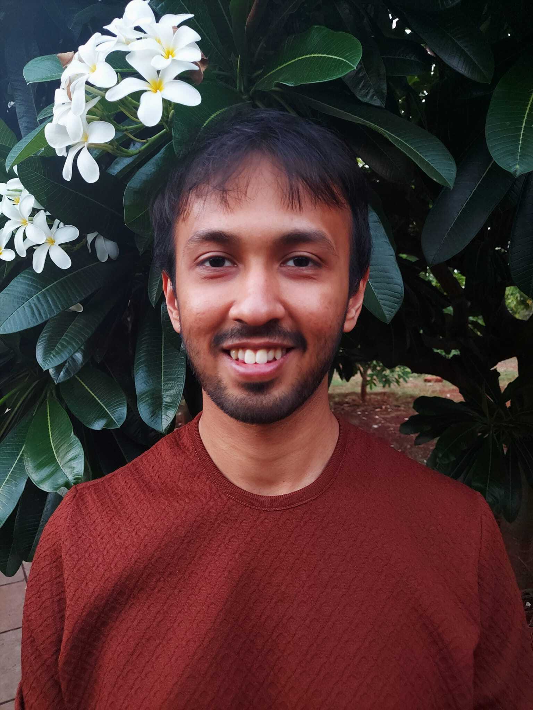

## Current members

### E.Yagmur Erten - PI

### Gaurav Athreya (external PhD student, University of Mainz, co-supervised with Prof. Hanna Kokko)

  
  

    I am a PhD student interested in using mathematical models to answer questions in evolutionary ecology. I work mainly on the evolution of sex, and on evolutionary conflicts of different flavours. I have worked previously on evolutionary transitions in individuality in endosymbioses, which has left me with an enduring interest in mutualisms and cooperation. I am from the southern Indian city of Bangalore, and outside the lab I enjoy bread-baking, sports, and trying new hobbies. Personal website: <a href="https://gauravathreya.github.io" target="_blank" rel="noopener"> https://gauravathreya.github.io </a>
  

### Arturo Comin Lucio (MSc student, University of Groningen): Cultural evolution

### Flora Murakeozy-Kis (BSc student, University of Groningen): Cultural evolution

## Past members

The past group members since March 2024.